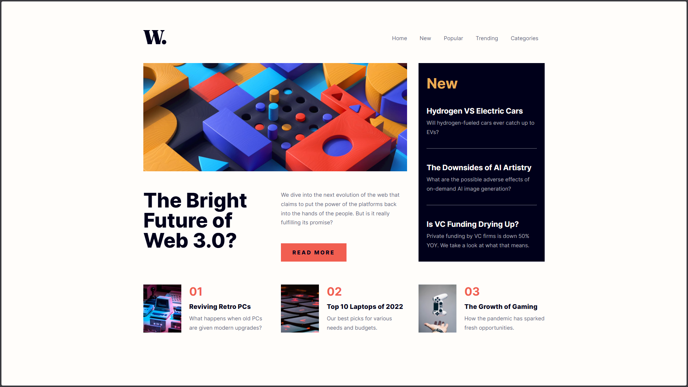

# Frontend Mentor - News homepage solution

This is a solution to the [News homepage challenge on Frontend Mentor](https://www.frontendmentor.io/challenges/news-homepage-H6SWTa1MFl). Frontend Mentor challenges help you improve your coding skills by building realistic projects.

## Table of contents

- [Overview](#overview)
  - [The challenge](#the-challenge)
  - [Screenshot](#screenshot)
  - [Links](#links)
- [My process](#my-process)
  - [Built with](#built-with)
  - [What I learned](#what-i-learned)
- [Author](#author)

## Overview

### The challenge

Users should be able to:

- View the optimal layout for the interface depending on their device's screen size
- See hover and focus states for all interactive elements on the page

### Screenshot

### Links

- Solution URL: [https://github.com/YoussefTK35/news-homepage](https://github.com/YoussefTK35/news-homepage)
- Live Site URL: [https://news-homepage-taki.vercel.app](https://news-homepage-taki.vercel.app)

## My process

### Built with

- Semantic HTML5 markup
- CSS custom properties
- Flexbox
- CSS Grid
- Desktop-first workflow
- JavaScript

### What I learned

I learned how to make responsive and accessible home page from scratch, and also how to make a hamburger menu.

## Author

- LinkedIn - [Youssef TAKI](https://www.linkedin.com/in/youssef-taki-tech)
- Frontend Mentor - [@YoussefTK35](https://www.frontendmentor.io/profile/YoussefTK35)
- X - [@YoussefTK35](https://www.x.com/YoussefTK35)
